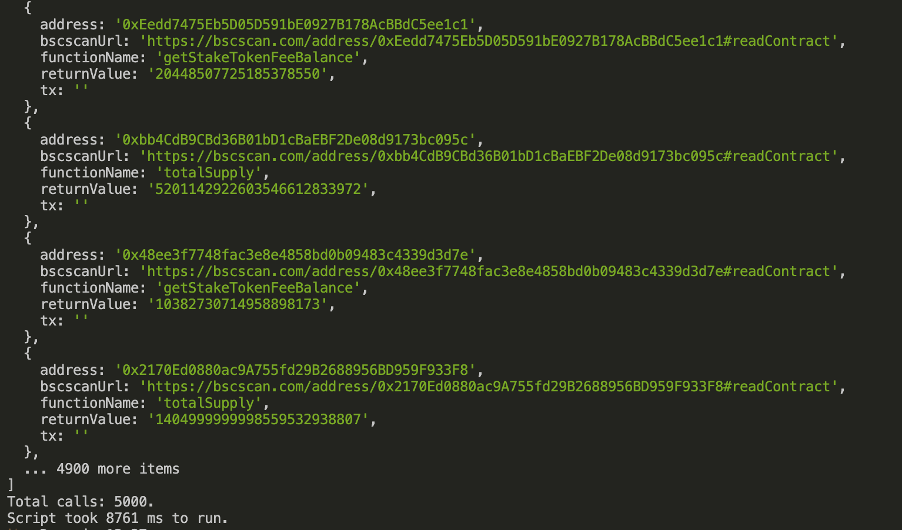

# Multicall SDK

Typescript package used to batch smart contract read calls into a single tx through the use of a multicall contract.   

## Supported Networks
The following networks have a multicall contract already deployed and can be accessed by providing an RPC url which points to the proper network. 

```javascript
export const multicallContracts: Partial<Record<ChainId, string>> = {
  [ChainId.BSC_MAINNET]: '0x7D82217018FAAcf81d4726134939C12300fF6B9E',
  [ChainId.BSC_TESTNET]: '0x7b6838b362f05bA2a0CAA8F9c1B34F3D619e7413',
  [ChainId.POLYGON_MAINNET]: '0x45b673A3a4bEa062e7cEF9149a0F2277B00c83b4',
  [ChainId.POLYGON_MUMBAI_TESTNET]: '0xcda26CD17E52a29EDaE0D2A15633d85A4594eC10',
}
```

<!-- TODO: 
* Ethereum 
* Polygon
* Avax
 -->

## Installation
```
npm i @defifofum/multicall

yarn add @defifofum/multicall
```

## Usage
Here is an example of how to use the multicall function.

### Options

```javascript
/**
 * Configurable options for multicall calls
 * maxCallsPerTx (default 1000) - The number of calls to batch in a single multicall tx
 * chainId (optional) - Pass the chainId to avoid needing to make an extra call to the provider to obtain it
 * blockTag (optional) - Use multicall at an earlier blocknumber 
 * customMulticallAddress (optional) - Pass in a user defined multicall contract to use. If using an archive node, 
 *      the multicall contracts in this repo may have been deployed AFTER the data you are looking for.
 * tryAggregate (optional) - Set this option to `true` to skip over failed calls
 */
export interface MultiCallOptions {
    maxCallsPerTx?: number;
    chainId?: number;
    tryAggregate?: boolean;
    blockTag?: BlockTag;
    customMulticallAddress?: string;
}
```

### Dynamic ABI 

See [multicallDynamicAbi](./examples/multicallDynamicAbi.ts) example for details on how to use multicall to make multiple calls with different ABIs. See the example output below.

To run the example: `yarn example`  

```javascript
import { multicallDynamicAbi, multicallDynamicAbiIndexedCalls, AbiCall } from '@defifofum/multicall';
```

`multicallDynamicAbiIndexedCalls` is an extended function of `multicallDynamicAbi` which allows batching related calls into separate arrays for easier decoding. Internally, the function combines all of the calls into a single call (up to the `maxBatchPerCall`) and puts them back into their proper batch relation. 

```javascript
export interface AbiCall {
    address: string // Address of the contract
    functionName: string // Function name on the contract (example: balanceOf)
    params?: any[] // Function params
    abi: (any | Fragment)[] // Abi of the call to make 
}
```

```javascript
/**
 * Batch multiple calls to contracts with the same abi to reduce rpc calls and increase response time. 
 * 
 * @param provider Ethers provider or Url of RPC endpoint to make the call to
 * @param calls Array of AbiCall objects to run through multicall
 * @param MultiCallOptions See MultiCallOptions interface for details on configurable options 
 * @returns Array of array of return values from each call. Index 0 is the first return value and so on.
 */
export async function multicallDynamicAbi(
    provider: string | providers.BaseProvider | providers.JsonRpcProvider,
    calls: AbiCall[],
    { maxCallsPerTx = 1000, blockTag = 'latest', tryAggregate = false, chainId, customMulticallAddress }: MultiCallOptions = {}
): Promise<any[][] | undefined>
```

```javascript
/**
 * Batch multiple calls to contracts with the same abi to reduce rpc calls and increase response time. 
 * 
 * @param provider Ethers provider or Url of RPC endpoint to make the call to
 * @param indexedCalls Array of Array of AbiCall. Return values match the shape of this array
 * @param MultiCallOptions See MultiCallOptions interface for details on configurable options 
 * @returns Array of array of return values from each call. Index 0 is the first return value and so on.
 */
export async function multicallDynamicAbiIndexedCalls(
    provider: string | providers.BaseProvider | providers.JsonRpcProvider,
    indexedCalls: AbiCall[][],
    { maxCallsPerTx = 1000, blockTag = 'latest', tryAggregate = false, chainId, customMulticallAddress }: MultiCallOptions = {}
): Promise<any[][] | any[]>
```

### Single ABI 

```javascript
import { multicall, Call } from '@defifofum/multicall';

// setup multicall
const callDataArray: Call[] = [];
for (const address of contractAddresses) {
    callDataArray.push({
        address: address,          // Address of the contract to call
        functionName: 'balanceOf', // Name of the contract function to call
        params: [ addressToCheck ] // Provide an array of args which map to arg0, arg1, argN
    });
}
// 
const returnedData = await multicall(
    RPC_PROVIDER,   // RPC url. ChainId is inferred from this to point to the proper contract
    ERC20.abi,      // abi of contract that is being called
    callDataArray,  // Call[]
    {
        maxCallsPerTx: 1000, // This param defaults to 1000. It sets the max batch limit per multicall call
    }                
);
// Pull addresses out of return data
const cleanedData = returnedData.map((dataArray, index) => {
    return {
        contractAddress: contractAddresses[index],
        bscscanUrl: `https://bscscan.com/address/${contractAddresses[index]}#readContract`,
        // Values are returned as an array for each return value. We are pulling out the singular balance variable here
        balance: dataArray[0].toString(),
    }
});
```


## Configuration
If you would like to deploy a multicall contract you will need to clone this repo and provide environment variables in a `.env` file based on `.env.example`. These variables are used to deploy and verify the contract. 


## Example Output
This example shows 5000 calls being made through this tool with two different ABIs mixed in. The run time is 8761ms.

